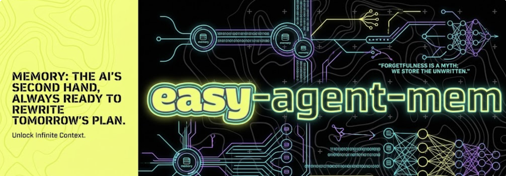

# agent-mem

**Automatic context compression and persistent memory for AI coding agents**

`agent-mem` watches your work, intelligently detects meaningful progress, and gives you a **one-paste handoff prompt** that tells your IDE agent to summarize, save durable memory, and start a fresh chat with minimal context.

No more repeating decisions. No more bloated chats. Just clean, automatic memory management.

---

### Why agent-mem

Long coding sessions lose context fast. Important decisions get buried, token limits are wasted, and every new chat starts cold.

`agent-mem` solves this by turning your project into a living, inspectable memory layer — automatically.

> While excellent tools like Mem0 exist, we built `agent-mem` to be lighter, CLI-first, and specifically optimized for one-paste context compression in Cursor, VS Code + Claude, and other modern AI IDEs.

---

### Core Features

- **Smart Watch Mode** — monitors file changes, git activity, and idle time
- **One-Paste Handoff** — Groq generates a structured prompt and copies it to your clipboard
- **Obsidian-First** — rich notes with YAML frontmatter, wiki-links, and graph support
- **Local Fallback** — works perfectly without Obsidian (`.agent-memory/`)
- **Strong IDE Rules** — generates sharp, effective instructions for your specific IDE
- **Zero extra models** — uses only your Groq API key (fast & very cheap)

---

### Quick Start

```bash
# 1. Install
pip install easy-agent-mem

# 2. Initialize (Obsidian optional)
agent-mem init

# 3. Add your Groq key (required for watch mode)
agent-mem configure-groq

# 4. Start automatic memory management
agent-mem watch
```

While you code normally, `agent-mem watch` runs silently in the background.  
When it detects meaningful work, it will automatically prepare a ready-to-paste prompt for your IDE.

---

### Commands

| Command                        | Description                                              |
|--------------------------------|----------------------------------------------------------|
| `agent-mem init`               | First-time setup (Obsidian + IDE rules)                  |
| `agent-mem configure-groq`     | Set or update your Groq API key                          |
| `agent-mem watch`              | Start automatic handoff watcher                          |
| `agent-mem test-watch`         | Simulate a trigger (safe testing)                        |
| `agent-mem summarize`          | Manually create a summary                                |
| `agent-mem recall <query>`     | Search your memory                                       |
| `agent-mem status`             | Show configuration and status                            |

---

### How Watch Mode Works

`agent-mem watch` is a lightweight local process that:

- Detects bursts of file changes + idle time + meaningful git diffs
- Calls Groq to generate a clean, structured handoff prompt
- Copies the prompt to your clipboard
- Writes it to `.agent-memory/outbox/latest-handoff.md`
- Shows a clear terminal alert

Just paste the prompt into your current IDE chat. Your agent will handle summarization, memory saving, and context reset.

---

### Storage Modes

**Obsidian Mode** (Recommended)  
Session notes are saved as rich Markdown files with frontmatter, wiki-links, and an auto-updated `Index.md` for excellent graph visibility.

**Local Fallback Mode**  
Everything stays inside `.agent-memory/` — no external tools required.

---

### IDE Integration

After `agent-mem init`, the tool automatically generates instruction files for your IDE:

- Cursor → `.cursor/rules/agent-mem.mdc`
- VS Code + Claude Code → `CLAUDE.md` / `.claude/instructions.md`

These rules are written to be followed strictly by modern agents.

---

### Star the Project

If `agent-mem` is helping you code better, please star the repository — it helps other developers discover it.

[](https://github.com/atharvavdeo/agent-mem)

---

### Project Links

- **PyPI**: [easy-agent-mem](https://pypi.org/project/easy-agent-mem/)
- **Source Code**: [github.com/atharvavdeo/agent-mem](https://github.com/atharvavdeo/agent-mem)
- **Issues**: [GitHub Issues](https://github.com/atharvavdeo/agent-mem/issues)

---

**Made for builders who want to spend more time coding and less time repeating themselves.**

---

**License**: MIT

---
